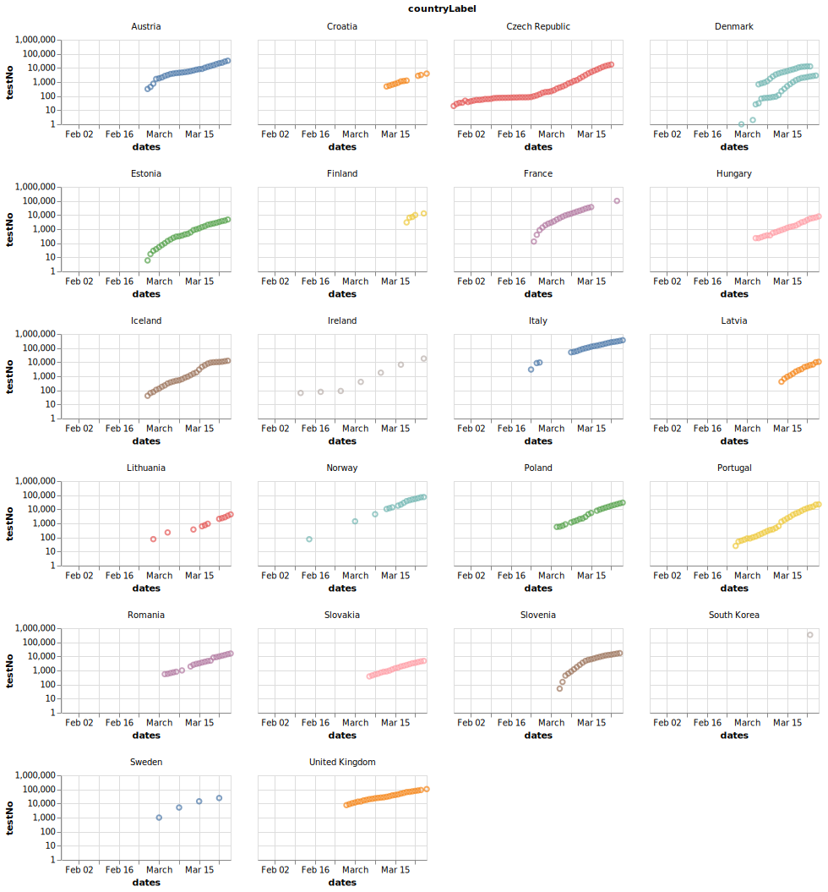

# Data on COVID-19 testing has been [merged][table] into Wikidata

Time-series data with the daily number of tests for COVID-19 by country.

> **UPDATE:** I merged the data into Wikidata. This way everybody can easily help expand coverage to more countries and help keep up-to-date with the latest published numbers. Get the [lastest available data][table] from Wikidata.

[][figure]

- **Temporal coverage**: 27. January 2020 -- 26. March 2020.
- **Spatial coverage**: 29 European countries.
- **Units/Measurement:** 
	- **Number of people tested:**
		- Sweden (SE) 
		- Norway (NO) 
		- Denmark (DK) 
		- United Kingdom (UK) 
		- Latvia (LV) 
		- Slovenia (SI) 
		- Portugal (PT) 
	- **Number of samples tested:**
		- Austria (AT)
		- Finland (FI)
		- Iceland (IS)
		- France (FR)
		- Croatia (HR)
		- Czech Republic (CZ)
		- Estonia (EE)
		- Hungary (HU)
		- Ireland (IE)
		- Lithuania (LT)
		- Poland (PL)
		- Romania (RO)
		- Slovakia (SK)
		- Italy (IT)
- **Missing data**: Official numbers are missing for the following European countries.
  -- Belgium (BE) 
  -- Ireland (IE) 
  -- Netherlands (NL) 
  -- Spain (ES) 
  -- Switzerland (CH)
  -- Germany (DE)
  -- Malta (MT)
- **Data sources:** Official numbers from government agencies or health organisations. In the dataset, each number has a reference. 

## Useful resources

**Data sources:** These resources are useful when tracking down official data sources for the number of for COVID-19 tests in different countries.

 - List of [coronavirus testing data sources](https://ourworldindata.org/coronavirus-testing-source-data) compiled by Esteban Ortiz-Ospina at _Our World in Data_. 
 - References in the Wikipedia page on [COVID-19 testing](https://en.wikipedia.org/wiki/COVID-19_testing).

**Retrieve numbers from Wikidata:** Download the latest data as a CSV file through the _Wikidata query service_.

Wikidata query to retrieve the [**number of clinical tests**][query] by country:

```SPARQL
SELECT ?dates ?testNo ?countryLabel ?itemLabel ?item WHERE {
  ?item wdt:P361 wd:Q83741704.
  ?item p:P8011 ?test. 
  ?test pq:P585 ?dates;
    ps:P8011 ?testNo
  OPTIONAL { ?item wdt:P17 ?country. }
  SERVICE wikibase:label { bd:serviceParam wikibase:language "[AUTO_LANGUAGE],en". }
}
ORDER BY (?countryLabel) (?itemLabel) (?dates)
```

Wikidata query to retrieve the [**number of cases, deaths, clinical tests and recoveries**][query_full] by country:

```SPARQL
SELECT ?item ?itemLabel ?countryLabel ?locationLabel ?dates ?caseNo ?deathNo ?testNo ?recoverNo  WHERE {
  ?item wdt:P361 wd:Q83741704.
  OPTIONAL { ?item wdt:P17 ?country. }
  OPTIONAL { ?item wdt:P276 ?location. }
  OPTIONAL {
    ?item p:P1603 ?cases.
    ?cases pq:P585 ?dates;
      ps:P1603 ?caseNo.
  }
  OPTIONAL {
    ?item p:P1120 ?deaths.
    ?deaths pq:P585 ?dates;
      ps:P1120 ?deathNo.
  }
  OPTIONAL { 
    ?item p:P8011 ?test. 
    ?test pq:P585 ?dates;
      ps:P8011 ?testNo
  }
  OPTIONAL { 
    ?item p:P8010 ?recover. 
    ?recover pq:P585 ?dates;
      ps:P8010 ?recoverNo
  }
  SERVICE wikibase:label { bd:serviceParam wikibase:language "[AUTO_LANGUAGE],en". }
  FILTER (!isBlank(?caseNo) || !isBlank(?deathNo) || !isBlank(?testNo) || !isBlank(?recoverNo))
}
ORDER BY (?countryLabel) (?locationLabel) (?dates)
```

## Contribute

Please consider contributing your time (or data) to the [Wikidata project on COVID-19](https://www.wikidata.org/wiki/Wikidata:WikiProject_COVID-19), fore instance by adding the latest official numbers in [your country](https://www.wikidata.org/wiki/Q83741704).

---

[query]: https://query.wikidata.org/#SELECT%20%3Fdates%20%3FtestNo%20%3FcountryLabel%20%3FitemLabel%20%3Fitem%20WHERE%20%7B%0A%20%20%3Fitem%20wdt%3AP361%20wd%3AQ83741704.%0A%20%20%3Fitem%20p%3AP8011%20%3Ftest.%20%0A%20%20%3Ftest%20pq%3AP585%20%3Fdates%3B%0A%20%20%20%20ps%3AP8011%20%3FtestNo%0A%20%20OPTIONAL%20%7B%20%3Fitem%20wdt%3AP17%20%3Fcountry.%20%7D%0A%20%20SERVICE%20wikibase%3Alabel%20%7B%20bd%3AserviceParam%20wikibase%3Alanguage%20%22%5BAUTO_LANGUAGE%5D%2Cen%22.%20%7D%0A%7D%0AORDER%20BY%20%28%3FcountryLabel%29%20%28%3FitemLabel%29%20%28%3Fdates%29 "Query for COVID-19 testing data from Wikidata"

[table]: https://query.wikidata.org/embed.html#SELECT%20%3Fdates%20%3FtestNo%20%3FcountryLabel%20%3FitemLabel%20%3Fitem%20WHERE%20%7B%0A%20%20%3Fitem%20wdt%3AP361%20wd%3AQ83741704.%0A%20%20%3Fitem%20p%3AP8011%20%3Ftest.%20%0A%20%20%3Ftest%20pq%3AP585%20%3Fdates%3B%0A%20%20%20%20ps%3AP8011%20%3FtestNo%0A%20%20OPTIONAL%20%7B%20%3Fitem%20wdt%3AP17%20%3Fcountry.%20%7D%0A%20%20SERVICE%20wikibase%3Alabel%20%7B%20bd%3AserviceParam%20wikibase%3Alanguage%20%22%5BAUTO_LANGUAGE%5D%2Cen%22.%20%7D%0A%7D%0AORDER%20BY%20%28%3FcountryLabel%29%20%28%3FitemLabel%29%20%28%3Fdates%29 "Table with COVID-19 testing data from Wikidata"

[figure]: https://query.wikidata.org/embed.html#%23defaultView%3ALineChart%0ASELECT%20%3Fdates%20%3FtestNo%20%3FcountryLabel%20%3FitemLabel%20%3Fitem%20WHERE%20%7B%0A%20%20%3Fitem%20wdt%3AP361%20wd%3AQ83741704.%0A%20%20%3Fitem%20p%3AP8011%20%3Ftest.%20%0A%20%20%3Ftest%20pq%3AP585%20%3Fdates%3B%0A%20%20%20%20ps%3AP8011%20%3FtestNo%0A%20%20OPTIONAL%20%7B%20%3Fitem%20wdt%3AP17%20%3Fcountry.%20%7D%0A%20%20SERVICE%20wikibase%3Alabel%20%7B%20bd%3AserviceParam%20wikibase%3Alanguage%20%22%5BAUTO_LANGUAGE%5D%2Cen%22.%20%7D%0A%7D%0AORDER%20BY%20%28%3FcountryLabel%29%20%28%3FitemLabel%29%20%28%3Fdates%29 "Figure with COVID-19 testing data from Wikidata"

[query_full]: https://query.wikidata.org/#SELECT%20%3Fitem%20%3FitemLabel%20%3FcountryLabel%20%3FlocationLabel%20%3Fdates%20%3FcaseNo%20%3FdeathNo%20%3FtestNo%20%3FrecoverNo%20%20WHERE%20%7B%0A%20%20%3Fitem%20wdt%3AP361%20wd%3AQ83741704.%0A%20%20OPTIONAL%20%7B%20%3Fitem%20wdt%3AP17%20%3Fcountry.%20%7D%0A%20%20OPTIONAL%20%7B%20%3Fitem%20wdt%3AP276%20%3Flocation.%20%7D%0A%20%20OPTIONAL%20%7B%0A%20%20%20%20%3Fitem%20p%3AP1603%20%3Fcases.%0A%20%20%20%20%3Fcases%20pq%3AP585%20%3Fdates%3B%0A%20%20%20%20%20%20ps%3AP1603%20%3FcaseNo.%0A%20%20%7D%0A%20%20OPTIONAL%20%7B%0A%20%20%20%20%3Fitem%20p%3AP1120%20%3Fdeaths.%0A%20%20%20%20%3Fdeaths%20pq%3AP585%20%3Fdates%3B%0A%20%20%20%20%20%20ps%3AP1120%20%3FdeathNo.%0A%20%20%7D%0A%20%20OPTIONAL%20%7B%20%0A%20%20%20%20%3Fitem%20p%3AP8011%20%3Ftest.%20%0A%20%20%20%20%3Ftest%20pq%3AP585%20%3Fdates%3B%0A%20%20%20%20%20%20ps%3AP8011%20%3FtestNo%0A%20%20%7D%0A%20%20OPTIONAL%20%7B%20%0A%20%20%20%20%3Fitem%20p%3AP8010%20%3Frecover.%20%0A%20%20%20%20%3Frecover%20pq%3AP585%20%3Fdates%3B%0A%20%20%20%20%20%20ps%3AP8010%20%3FrecoverNo%0A%20%20%7D%0A%20%20SERVICE%20wikibase%3Alabel%20%7B%20bd%3AserviceParam%20wikibase%3Alanguage%20%22%5BAUTO_LANGUAGE%5D%2Cen%22.%20%7D%0A%20%20FILTER%20%28%21isBlank%28%3FcaseNo%29%20%7C%7C%20%21isBlank%28%3FdeathNo%29%20%7C%7C%20%21isBlank%28%3FtestNo%29%20%7C%7C%20%21isBlank%28%3FrecoverNo%29%29%0A%7D%0AORDER%20BY%20%28%3FcountryLabel%29%20%28%3FlocationLabel%29%20%28%3Fdates%29 "Query for COVID-19 data from Wikidata"